**English** | [中文](README.zh-CN.md)

<p align="center">
  
</p>

<p align="center">
  <a href="https://pypi.org/project/clade-mcp/"></a>
  <a href="https://github.com/shenxingy/clade/blob/main/CONTRIBUTING.md"></a>
  <a href="https://github.com/shenxingy/clade/labels/good%20first%20issue"></a>
</p>

# Clade

**Autonomous coding, evolved.**

93 skills, 20 hooks, 35 agents, a safety guardian, and a correction learning loop — all working together so Claude codes better, catches its own mistakes, and can run unattended overnight while you sleep.

> If this saves you time, a star helps others find it. Something broken? [Open an issue](https://github.com/shenxingy/clade/issues/new/choose).

> **Blog post:** [Building Clade](https://alexshen.dev/en/blog/clade) — motivation, design decisions, and lessons learned.

## Table of Contents

1. [Install](#install)
2. [MCP Server](#mcp-server--use-skills-in-any-ai-editor)
3. [What It Does](#what-it-does)
4. [Skills](#skills-93)
5. [Hooks](#hooks-14)
6. [Supported Languages](#supported-languages)
7. [Documentation](#documentation)
8. [Repo Structure](#repo-structure)
9. [Contributing](#contributing)
10. [License](#license)

## Install

### Full Framework (recommended)

```bash
git clone https://github.com/shenxingy/clade.git
cd clade && ./install.sh
```

Installs skills, hooks, agents, scripts, and safety guardian. Start a new Claude Code session to activate.

> **Requires:** `jq`. **Platform:** Linux and macOS.

### MCP Server Only

If you just want the skills in Cursor, Windsurf, Claude Desktop, or any MCP client:

```bash
pip install clade-mcp
```

See [MCP Server](#mcp-server--use-skills-in-any-ai-editor) below for configuration.

## MCP Server — Use Skills in Any AI Editor

The MCP server exposes all 93 Clade skills as callable tools via the [Model Context Protocol](https://modelcontextprotocol.io). Works with any MCP-compatible client.

**Claude Desktop / Claude Code:**
```json
{
  "mcpServers": {
    "clade": { "command": "uvx", "args": ["clade-mcp"] }
  }
}
```

**Cursor / Windsurf:**
```json
{
  "mcpServers": {
    "clade": { "command": "clade-mcp" }
  }
}
```

> **Prerequisite:** [Claude Code CLI](https://docs.anthropic.com/en/docs/claude-code) must be installed — skills execute via `claude -p`.

## What It Does

| When | What fires | Effect |
|------|-----------|--------|
| Session opens in a git repo | `session-context.sh` | Loads git context, handoff state, correction rules, model guidance |
| Claude runs a bash command | `pre-tool-guardian.sh` | **Blocks** dangerous ops: migrations, `rm -rf`, force push, `DROP TABLE` |
| Claude edits code | `post-edit-check.sh` | Async type-check (tsc, pyright, cargo check, go vet, etc.) |
| You correct Claude | `correction-detector.sh` | Logs correction, prompts Claude to save a reusable rule |
| Claude marks task done | `verify-task-completed.sh` | Adaptive quality gate: compile + lint, build + test in strict mode |

See [How It Works](docs/how-it-works.md) for the full hook reference (20 hooks).

## Skills (93)

### Core Workflow

| Skill | What it does |
|-------|-------------|
| `/commit` | Split changes into logical commits by module, push by default |
| `/sync` | Check off completed TODOs, append session summary to PROGRESS.md |
| `/review` | 8-phase coverage review — finds AND fixes issues, loops until clean |
| `/verify` | Verify project behavior anchors (compile, test, lint) |

### Autonomous Operation

| Skill | What it does |
|-------|-------------|
| `/start` | Autonomous session launcher — morning brief, overnight runs, cross-project patrol |
| `/loop GOAL` | Goal-driven improvement loop — supervisor plans, workers execute in parallel |
| `/batch-tasks` | Execute TODO steps via unattended sessions (serial or parallel) |
| `/orchestrate` | Decompose goals into tasks for worker execution |
| `/handoff` | Save session state for context relay between agents |
| `/pickup` | Resume from previous handoff — zero-friction restart |
| `/worktree` | Create git worktrees for parallel sessions |

### Code Quality

| Skill | What it does |
|-------|-------------|
| `/review-pr N` | AI code review on a PR diff — Critical / Warning / Suggestion |
| `/merge-pr N` | Squash-merge PR and clean up branch |
| `/investigate` | Root cause analysis — no fix without confirmed hypothesis |
| `/incident DESC` | Incident response — diagnose, postmortem, follow-up tasks |
| `/cso` | Security audit (OWASP + STRIDE) |
| `/map` | Generate ARCHITECTURE.md with module graph + file ownership |

### Research & Planning

| Skill | What it does |
|-------|-------------|
| `/research TOPIC` | Deep web research, synthesize to docs/research/ |
| `/model-research` | Latest Claude model data + auto-update configs |
| `/next` | Multi-angle priority session — surface best next move |
| `/brief` | Morning briefing — overnight commits, costs, next steps |
| `/retro` | Engineering retrospective from git history |
| `/frontend-design` | Create production-grade frontend interfaces |

### System

| Skill | What it does |
|-------|-------------|
| `/audit` | Clean up correction rules — promote, deduplicate, remove stale |
| `/document-release` | Post-ship doc sync (README, CHANGELOG, CLAUDE.md) |
| `/pipeline` | Health check for background pipelines |
| `/provider` | Switch LLM provider |
| `slt` | Toggle statusline quota pace indicator |

### Blog & Content (22 skills)

| Skill | What it does |
|-------|-------------|
| `/blog` | Full lifecycle — brief → outline → write → SEO check |
| `/blog-write` | Write SERP-informed articles from scratch |
| `/blog-rewrite` | Optimize existing posts for quality and SEO |
| `/blog-audit` | Full-site health scan (thin content, meta, cannibalization) |
| + 18 more | analyze · audio · brief · calendar · chart · factcheck · geo · google · image · notebooklm · outline · persona · repurpose · schema · seo-check · strategy · taxonomy · cannibalization |

### SEO (19 skills)

| Skill | What it does |
|-------|-------------|
| `/seo` | Full SEO audit suite |
| `/seo-technical` | Crawlability, indexability, Core Web Vitals |
| `/seo-page` | Deep single-page analysis |
| `/seo-content` | E-E-A-T and content quality scoring |
| + 15 more | audit · backlinks · competitor-pages · dataforseo · geo · google · hreflang · image-gen · images · local · maps · plan · programmatic · schema · sitemap |

### Paid Ads (18 skills)

| Skill | What it does |
|-------|-------------|
| `/ads` | Multi-platform ads audit suite |
| `/ads-google` | Google Ads — Quality Score, PMax, bidding |
| `/ads-meta` | Meta Ads — Pixel/CAPI, creative fatigue, Advantage+ |
| `/ads-create` | Create new ad campaigns from brief |
| + 14 more | apple · audit · budget · competitor · creative · dna · generate · landing · linkedin · microsoft · photoshoot · plan · tiktok · youtube |

See [When to Use What](docs/when-to-use-what.md) for detailed usage guidance.

## Supported Languages

Auto-detected — hooks and agents adapt to your project:

| Language | Edit check | Type checker | Test runner |
|----------|-----------|-------------|-------------|
| TypeScript / JavaScript | tsc (monorepo-aware) | tsc | jest / vitest |
| Python | pyright / mypy | pyright / mypy | pytest |
| Rust | cargo check | cargo check | cargo test |
| Go | go vet | go vet | go test |
| Swift / iOS | swift build | swift build | swift test |
| Kotlin / Android / Java | gradlew | gradlew | gradle test |
| LaTeX | chktex | chktex | — |

All checks are opt-in by detection — if the tool isn't installed, the hook silently skips.

## Documentation

| Guide | Contents |
|-------|----------|
| [Maximize Throughput](docs/throughput.md) | Skip permissions, batch tasks, parallel worktrees, terminal + voice |
| [Orchestrator Web UI](docs/orchestrator.md) | Chat-to-plan, worker dashboard, settings, iteration loop |
| [Overnight Operation](docs/autonomous-operation.md) | Task queue, parallel sessions, context relay, safety |
| [How It Works](docs/how-it-works.md) | Hooks, agents, skills internals, correction learning, model selection |
| [Configuration](docs/configuration.md) | Settings, thresholds, adding custom hooks/agents/skills |
| [When to Use What](docs/when-to-use-what.md) | Detailed usage guidance for every skill |

## Dotfile Sync

Keep `~/.claude/` in sync across machines — memory, corrections, skills, hooks, and scripts.

```bash
~/.claude/scripts/sync-setup.sh            # auto-detect NFS or GitHub
~/.claude/scripts/sync-setup.sh --github   # explicit GitHub backend
```

Fully automatic once configured. See [Configuration](docs/configuration.md) for details.

## Repo Structure

```
clade/
├── install.sh               # One-command deployment
├── uninstall.sh             # Clean removal
├── mcp-package/             # PyPI package (clade-mcp)
├── orchestrator/            # FastAPI web UI + worker pool + task queue
│   ├── server.py            # App, routes, WebSocket
│   ├── worker.py            # WorkerPool, SwarmManager
│   ├── task_queue.py        # SQLite-backed task CRUD
│   ├── mcp_server.py        # MCP server (local dev version)
│   └── web/                 # Single-page dashboard
├── configs/
│   ├── skills/              # 93 skill definitions (SKILL.md + prompt.md)
│   ├── hooks/               # 20 event hooks + lib/
│   ├── agents/              # 35 agent definitions
│   └── scripts/             # 27 shell + Python utilities
├── adapters/openclaw/       # OpenClaw integration (mobile monitoring)
├── templates/               # Settings, CLAUDE.md, corrections templates
└── docs/                    # Guides and research
```

## OpenClaw Integration

Monitor and control overnight loops from your phone via [OpenClaw](https://openclaw.ai).

| Skill | Trigger | Effect |
|-------|---------|--------|
| clade-status | "how's the loop going" | Iteration progress, cost, commits |
| clade-control | "start a loop to fix tests" | Start/stop autonomous loops |
| clade-report | "what did it do overnight" | Session report, cost breakdown |

See [`adapters/openclaw/README.md`](adapters/openclaw/README.md) for setup.

## Contributing

Contributions welcome — code, docs, issue triage, bug reports. See [CONTRIBUTING.md](CONTRIBUTING.md).

### Known Limitations

1. **Loop on non-code tasks** (research/docs) fails silently — workers produce no diff, loop reports failure
2. **Workers inherit parent env** — project-specific env vars leak into worker shells; sanitize before overnight runs
3. **Context budget is per-session** — multi-day runs may exhaust context; use `/handoff` + `/pickup`

## License

[MIT](LICENSE)
