[English](README.md) | **中文**

<p align="center">
  
</p>

<p align="center">
  <a href="https://pypi.org/project/clade-mcp/"></a>
  <a href="https://github.com/shenxingy/clade/blob/main/CONTRIBUTING.md"></a>
  <a href="https://github.com/shenxingy/clade/labels/good%20first%20issue"></a>
</p>

# Clade

**面向 coding agents 的 provider-neutral 交付控制平面。**

Clade 把 agent 的工作变成可复查的交付：解析后的执行身份、不可变证据、
校准过的验证、纠正学习，以及真实保留语义的 Git 历史。它同时提供 Claude Code
完整框架、Codex 原生插件和面向其他客户端的 MCP bridge。

可选的 **Orchestrator** 进一步提供 provider/model registry、证据与 eval
控制平面、verifier-aware routing、交付状态，以及跨项目 fleet truth。

> 如果它帮你省了时间，点个 star 能帮更多人找到它。出问题了？[提 issue](https://github.com/shenxingy/clade/issues/new/choose)。

> **博客文章：** [Building Clade](https://alexshen.dev/zh/blog/clade) — 项目的动机、设计决策和经验教训。

## 目录

1. [安装](#安装)
2. [MCP Server](#mcp-server--在任何-ai-编辑器中使用-skills)
3. [可信交付循环](#可信交付循环)
4. [它做什么](#它做什么)
5. [自学习机制](#自学习机制)
6. [Skills](#skills-136)
7. [支持的语言](#支持的语言)
8. [文档](#文档)
9. [Dotfile 同步](#dotfile-同步)
10. [仓库结构](#仓库结构)
11. [OpenClaw 集成](#openclaw-集成)
12. [贡献](#贡献)
13. [License](#license)

## 安装

### Claude Code — 完整框架

```bash
git clone https://github.com/shenxingy/clade.git
cd clade && ./install.sh
```

安装 skills、hooks、agents、scripts 和安全守卫。启动新的 Claude Code 会话即可激活。

> **依赖：** `jq`。**平台：** Linux、macOS，以及通过 Git Bash 的 Windows（不含 bash 的原生 CMD/PowerShell 不在支持范围内）。

### Codex — 原生插件

```bash
codex plugin marketplace add shenxingy/Clade
codex plugin add clade@clade
```

安装后启动新的 Codex thread，并通过插件限定名 `$clade:review`、
`$clade:verify`、`$clade:investigate` 等技能直接运行 Clade。首次使用时
打开 `/hooks`，检查并信任 Clade 的 session context 和危险命令防护 hooks。
原生插件无需安装 Claude Code。

运行 `$clade:codex-usage setup minimal` 使用极简原生 footer。
`$clade:codex-usage` 默认显示同样极简的 `project(branch)-9% (6d)` 节奏；
图标和详细模式均为可选，而且不会读取或暴露 Codex 登录凭证。

完整说明与兼容边界见 [Codex 原生支持](docs/codex.zh-CN.md)。

### 仅 MCP Server

如果希望在其他 MCP 客户端里使用 Clade skills：

```bash
pip install --upgrade clade-mcp
```

0.2.0 新增 Codex execution runtime，同时继续以 Claude 作为向后兼容的默认值。
配置见下方 [MCP Server](#mcp-server--在任何-ai-编辑器中使用-skills)，完整参数见
[MCP package 中文指南](mcp-package/README.zh-CN.md)。

## MCP Server — 在任何 AI 编辑器中使用 Skills

MCP package 通过 [Model Context Protocol](https://modelcontextprotocol.io)
暴露 34 个内置 Clade skills，并可选择通过 Claude 或 Codex 执行。

**Claude Desktop，或使用 Claude runtime 的其他客户端：**
```json
{
  "mcpServers": {
    "clade": { "command": "uvx", "args": ["clade-mcp"] }
  }
}
```

**Cursor / Windsurf：**
```json
{
  "mcpServers": {
    "clade": {
      "command": "clade-mcp",
      "env": { "CLADE_RUNTIME": "codex" }
    }
  }
}
```

`CLADE_RUNTIME` 支持 `claude`（兼容旧版本的默认值）、`codex` 和 `auto`。
在 Codex 自身内部应优先使用原生插件，避免重复加载 skills 和启动嵌套 agent；
Claude Code 完整框架已经原生安装 Clade skills，也不应重复挂载 MCP server。

## 可信交付循环

Clade 把六个维度分开处理，避免一次“看起来是绿的”运行悄悄改变 runtime、
账号、历史或证据语义：

| 层 | 合同 |
|---|---|
| 执行身份 | 分别解析 agent runtime、原生 connection、inference provider、wire protocol 和 opaque model |
| 证据 | attempt 以 digest-linked revision 追加 task、timing、Git SHA、测试、oracle、成本、artifact 和 delivery 证据 |
| Verifier 校准 | cheap→strong routing 默认关闭，必须有 deterministic verifier 证据；观察报告不能自动改策略 |
| 纠正学习 | 显式纠正把被拒工作与人工上下文配对，形成待审 eval candidate；不存在自动 ground truth |
| 交付 | exact reviewed SHA、live PR topology、CI 和仓库策略共同决定 merge 语义；squash 不是通用默认值 |
| Fleet truth | provider catalog、任务、usage、证据健康和 delivery 状态都保留 provenance 与 freshness |

证据和 oracle approval 是门禁与审计材料，不代表自动获得 publish/merge
权限；外部副作用仍由仓库策略和明确授权决定。

## 它做什么

| 时机 | 触发什么 | 效果 |
|------|---------|------|
| 在 git 仓库中打开会话 | `session-context.sh` | 加载 git 上下文、handoff 状态、纠正规则、模型指南 |
| 在 git 仓库中打开会话 | `commit-archeology.sh` | 从 `git log` 挖掘重复修复模式（wiring/deploy/compat gap、Claude-overridden）— 注入 top 4 |
| Claude 执行 bash 命令 | `pre-tool-guardian.sh` | **拦截**危险操作：数据库迁移、`rm -rf`、force push、`DROP TABLE` |
| Claude 编辑代码 | `post-edit-check.sh` | 异步类型检查（tsc、pyright、cargo check、go vet 等） |
| 你纠正 Claude | `correction-detector.sh` | 记录纠正，提示 Claude 保存可复用的规则 |
| Claude 标记任务完成 | `verify-task-completed.sh` | 自适应质量门禁：compile + lint，严格模式额外 build + test |

完整 hook 参考（31 个 hooks）见 [How It Works](docs/how-it-works.md)。

## 自学习机制

三个机制让 Clade 与现实保持一致：

- **Commit Lessons**（响应式）— `commit-archeology.sh` 从 `git log` 挖掘重复修复模式（wiring-gap、deploy-gap、compat-gap、**claude-overridden**），每次会话启动时注入 top 4。
- **Doc Align**（预防式）— `doc-align.py` 在 `docs/facts.json` 中声明共享事实（从文件系统自动推导），检查/自动修复所有 `*.md` 的漂移。PostToolUse hook 在你编辑文档的瞬间标记漂移，过期数字到不了 commit。
- **Correction Pairing**（人工定真）— 显式纠正把被拒工作与替代上下文配对；
  Orchestrator 把它隔离成 eval candidate，只有显式人工 review 才能提升为 corpus truth。

Commit Lessons 与 Doc Align 在 Claude 完整框架中本地运行，未启用的仓库静默
跳过。推断出的 revert 或异步信号不会自动写成规则。

详见 [Self-Learning Mechanisms](docs/learning-mechanisms.md)。

## Skills (136)

### 核心工作流

| Skill | 功能 |
|-------|------|
| `/commit` | 创建适配仓库的 checkpoint commits；已有授权时发布 |
| `/sync` | 勾掉完成的 TODO，追加会话总结到 PROGRESS.md |
| `/review` | 8 阶段覆盖式审查 — 发现并修复问题，循环到干净为止 |
| `/verify` | 验证项目行为锚点（compile、test、lint） |

### 自主运行

| Skill | 功能 |
|-------|------|
| `/start` | 自主会话启动器 — 晨间简报、通宵运行、跨项目巡检 |
| `/loop GOAL` | 目标驱动改进循环 — 主管规划，workers 并行执行 |
| `/iloop TASK` | 会话内迭代循环 — Stop hook 反复喂回提示词直到完成（无后台 workers） |
| `/batch-tasks` | 通过无人值守会话执行 TODO 步骤（串行或并行） |
| `/orchestrate` | 把目标拆解为任务供 workers 执行 |
| `/handoff` | 保存会话状态，供 agent 间上下文接力 |
| `/pickup` | 从上次 handoff 恢复 — 零摩擦重启 |
| `/worktree` | 创建 git worktrees 支持并行会话 |
| `/poke` | 按 `esc` 后的心跳 — 3 行状态汇报，进展正常就继续 |
| `/status` | 会话仪表盘 — 后台 agents、loops、worktrees、未推送 commits |
| `/go` | 直接执行你最近一组 A/B/C 选项中的推荐项 |

### 代码质量

| Skill | 功能 |
|-------|------|
| `/review-pr N` | AI 审查 PR diff — Critical / Warning / Suggestion |
| `/merge-pr N` | 按 topology 与 history 语义合并 exact reviewed PR，并清理分支 |
| `/investigate` | 根因分析 — 假设未确认不动手修 |
| `/incident DESC` | 事故响应 — 诊断、复盘、后续任务 |
| `/cso` | 安全审计（OWASP + STRIDE） |
| `/map` | 生成 ARCHITECTURE.md（模块图 + 文件归属） |

### 调研与规划

| Skill | 功能 |
|-------|------|
| `/research TOPIC` | 深度网络调研，综合保存到 docs/research/ |
| `/model-research` | 最新 Claude 模型数据 + 自动更新配置 |
| `/next` | "下一步做什么" — 默认 1 次直给推荐；`/next deep` 多轮访谈 |
| `/brief` | 早晨简报 — 过夜 commits、成本、下一步 |
| `/retro` | 基于 git 历史的工程复盘 |
| `/frontend-design` | 生产级前端界面生成 |

### 系统

| Skill | 功能 |
|-------|------|
| `/audit` | 清理纠正规则 — 升级、去重、删除过期 |
| `/document-release` | 发布后文档同步（README、CHANGELOG、CLAUDE.md） |
| `/pipeline` | 后台 pipeline 健康检查 |
| `/provider` | 切换 LLM provider |
| `slt` | 切换状态栏配额进度指示器 |

### 博客与内容（30 个 skills）

| Skill | 功能 |
|-------|------|
| `/blog` | 全生命周期 — brief → outline → write → SEO check |
| `/blog-write` | 从零写 SERP-informed 文章 |
| `/blog-rewrite` | 优化已有文章的质量与 SEO |
| `/blog-audit` | 全站健康扫描（薄内容、meta、关键词蚕食） |
| + 26 个 | analyze · audio · brand · brief · calendar · cannibalization · chart · cluster · discourse · factcheck · flow · geo · google · image · locale-audit · localize · multilingual · notebooklm · outline · persona · repurpose · schema · seo-check · strategy · taxonomy · translate |

### SEO（25 个 skills）

| Skill | 功能 |
|-------|------|
| `/seo` | 完整 SEO 审计套件 |
| `/seo-technical` | 可抓取性、可索引性、Core Web Vitals |
| `/seo-page` | 单页深度分析 |
| `/seo-content` | E-E-A-T 与内容质量评分 |
| + 21 个 | audit · backlinks · cluster · competitor-pages · content-brief · dataforseo · drift · ecommerce · flow · geo · google · hreflang · image-gen · images · local · maps · plan · programmatic · schema · sitemap · sxo |

### 付费广告（23 个 skills）

| Skill | 功能 |
|-------|------|
| `/ads` | 多平台广告审计套件 |
| `/ads-google` | Google Ads — Quality Score、PMax、出价 |
| `/ads-meta` | Meta Ads — Pixel/CAPI、素材疲劳、Advantage+ |
| `/ads-create` | 从 brief 创建新广告活动 |
| + 19 个 | amazon · apple · attribution · audit · budget · competitor · creative · dna · generate · landing · linkedin · math · microsoft · photoshoot · plan · server-side-tracking · test · tiktok · youtube |

### 邮件（6 个 skills）

| Skill | 功能 |
|-------|------|
| `/email-write` | 用成熟文案框架（PAS、AIDA、BAB）写高转化邮件 |
| `/email-audit` | 送达率审计 — SPF、DKIM、DMARC、黑名单、健康分 |
| `/email-sequence` | 设计自动化序列（welcome、nurture、re-engagement） |
| + 3 个 | check · plan · review |

每个 skill 的详细使用指南见 [When to Use What](docs/when-to-use-what.md)。

## 支持的语言

自动检测 — hooks 和 agents 适配你的项目：

| 语言 | 编辑检查 | 类型检查器 | 测试执行器 |
|------|---------|-----------|-----------|
| TypeScript / JavaScript | tsc（monorepo 感知） | tsc | jest / vitest |
| Python | pyright / mypy | pyright / mypy | pytest |
| Rust | cargo check | cargo check | cargo test |
| Go | go vet | go vet | go test |
| Swift / iOS | swift build | swift build | swift test |
| Kotlin / Android / Java | gradlew | gradlew | gradle test |
| LaTeX | chktex | chktex | — |

所有检查按检测自动启用 — 工具未安装时 hook 静默跳过。

## 文档

| 指南 | 内容 |
|------|------|
| [Codex 原生支持](docs/codex.zh-CN.md) | Plugin 安装、原生 skills/hooks、MCP runtime 与兼容边界 |
| [MCP Package](mcp-package/README.zh-CN.md) | clade-mcp 0.2.0 安装、runtime、sandbox 与 skills 列表 |
| [0.2.0 Release Notes](docs/releases/v0.2.0.md#中文说明) | Codex 原生支持、MCP 变更、升级步骤与验证结果 |
| [更新记录](CHANGELOG.zh-CN.md) | Release 历史与升级说明 |
| [最大化产出](docs/throughput.md) | 跳过权限确认、批量任务、并行 worktrees、终端与语音 |
| [编排 Web UI](docs/orchestrator.md) | 聊天规划、worker 仪表盘、设置、迭代循环 |
| [通宵自主运行](docs/autonomous-operation.md) | 任务队列、并行会话、上下文接力、安全保障 |
| [工作原理](docs/how-it-works.md) | Hooks、agents、skills 内部机制、纠正学习、模型选择 |
| [配置](docs/configuration.md) | 设置、阈值、添加自定义 hooks/agents/skills |
| [什么时候用什么](docs/when-to-use-what.md) | 每个 skill 的详细使用指南 |

## Dotfile 同步

让 `~/.claude/` 跨机器保持一致 — 记忆、纠正规则、skills、hooks、scripts。

```bash
~/.claude/scripts/sync-setup.sh            # 自动检测 NFS 或 GitHub
~/.claude/scripts/sync-setup.sh --github   # 显式指定 GitHub 后端
```

配置后完全自动。详见 [配置](docs/configuration.md)。

## 仓库结构

```
clade/
├── install.sh               # 一键部署
├── uninstall.sh             # 干净卸载
├── mcp-package/             # PyPI 包（clade-mcp）
├── plugins/clade/           # Codex 原生插件（25 个核心 skills + hooks）
├── .agents/plugins/         # Codex marketplace manifest
├── orchestrator/            # FastAPI Web UI + worker 池 + 任务队列
│   ├── server.py            # 应用、路由、WebSocket
│   ├── worker.py            # Worker、WorkerPool
│   ├── task_queue.py        # SQLite 任务 CRUD
│   ├── mcp_server.py        # MCP server（本地开发版）
│   └── web/                 # React + Vite 仪表盘（web/src/，从 web/dist 提供服务）
├── configs/
│   ├── skills/              # 136 个 skill 定义
│   ├── hooks/               # 31 个事件 hooks + lib/
│   ├── agents/              # 37 个 agent 定义
│   └── scripts/             # 40 个 shell + 23 个 Python 工具
├── adapters/openclaw/       # OpenClaw 集成（手机监控）
├── templates/               # settings、CLAUDE.md、corrections 模板
└── docs/                    # 指南与研究
```

## OpenClaw 集成

通过 [OpenClaw](https://openclaw.ai) 从手机监控和控制通宵循环。

| Skill | 触发语 | 效果 |
|-------|--------|------|
| clade-status | "跑到哪了" | 迭代进度、成本、commits |
| clade-control | "开始 loop 修测试" | 启动/停止自主循环 |
| clade-report | "昨晚干了什么" | 会话报告、成本明细 |

安装见 [`adapters/openclaw/README.md`](adapters/openclaw/README.md)。

## 贡献

欢迎贡献 — 代码、文档、issue 分类、bug 报告。详见 [CONTRIBUTING.md](CONTRIBUTING.md)。

### 已知限制

1. **Loop 处理非代码任务**（调研/文档）时静默失败 — workers 没有 diff，loop 报告失败
2. **Workers 继承父环境** — 项目特定的环境变量会泄漏到 worker shell；通宵运行前请清理
3. **上下文预算按会话计** — 多天运行可能耗尽上下文；用 `/handoff` + `/pickup`

## License

[MIT](LICENSE)
