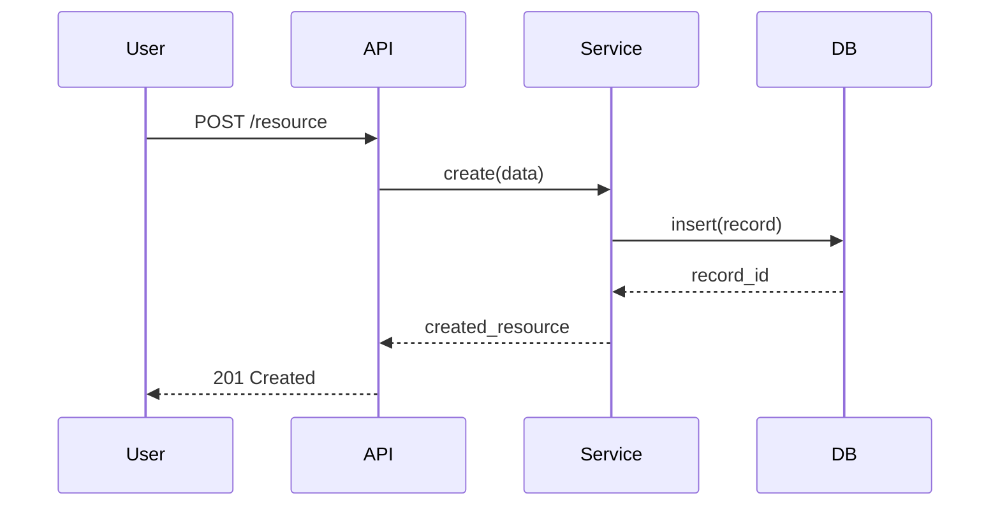

# AWS Kiro 深度研究报告

**日期**: 2026-03-30  
**来源**: kiro.dev 官网、AWS re:Post、InfoQ、Martin Fowler、DevClass、各社区评测  
**研究目的**: 理解 spec-driven development 设计哲学，寻找可移植到 Clade 的设计模式

---

## 一、背景与定位

### Kiro 是什么

Kiro 是 AWS 于 2025 年 7 月发布的 agentic IDE（基于 VS Code fork），2025 年 11 月正式 GA。底层由 Anthropic Claude（Sonnet 4.5）驱动，支持"Auto"模式混合调用前沿模型。

### 核心问题：Vibe Coding 的失控

"Vibe coding"的本质缺陷不是效率低，而是**决策无迹可寻**：
- AI 生成代码时做了什么假设？没有记录
- 为什么选了这个技术方案？没有记录  
- 下一个开发者（或三个月后的自己）无从理解

Kiro 的 Marc Brooker 总结得最精准：**"What assumptions did the model make when building it? You guided the agent throughout, but those decisions aren't documented."**

### 设计哲学：从"如何做"到"做什么"

60 年来编程都是描述 *how*（实现细节）。Kiro 的野心是让开发者描述 *what*（目标和意图），让 AI 处理 how。类比 SQL：你说"给我所有年龄>30的用户"，不用管数据库怎么 JOIN 的。

这个哲学创造了一个核心机制：**Specification as North Star** — 规范不是文档，是 agent 的行动指南和验证基准。

---

## 二、三文件规范系统（核心机制）

所有 spec 文件存储在 `.kiro/specs/{feature_name}/` 目录下。

### 2.1 requirements.md — EARS 格式

**EARS = Easy Approach to Requirements Syntax**，由 Rolls-Royce 工程师 Alistair Mavin 开发，专门用于约束自然语言需求的结构化表达。

#### 完整 EARS 模式库

| 模式 | 语法 | 用途 |
|------|------|------|
| 事件触发 | `WHEN [condition] THE SYSTEM SHALL [behavior]` | 最常用，表达交互行为 |
| 持续状态 | `WHILE [ongoing condition] the system SHALL [behavior]` | 持续性约束 |
| 条件 | `IF [state] THEN the system SHALL [response]` | 条件分支行为 |
| 上下文 | `WHERE [context] the system SHALL [behavior]` | 特定场景约束 |
| 防回归 | `WHEN [condition] THEN system SHALL CONTINUE TO [existing behavior]` | bugfix spec 专用 |

#### 完整 requirements.md 模板

```markdown
# Requirements Document

## Introduction
[功能概述，一段话说明业务价值]

## Requirements

### Requirement 1: [功能名称]
**User Story:** As a [persona], I want [functionality], so that [benefit].

#### Acceptance Criteria
1. WHEN [event/condition] THE SYSTEM SHALL [expected behavior]
2. WHEN [event/condition] THE SYSTEM SHALL [expected behavior]
3. WHILE [ongoing state] the system SHALL [continuous behavior]
4. IF [condition] THEN the system SHALL [conditional response]

### Requirement 2: [功能名称]
**User Story:** As a [persona], I want [functionality], so that [benefit].

#### Acceptance Criteria
1. WHEN [event/condition] THE SYSTEM SHALL [expected behavior]
2. WHEN [event/condition] THE SYSTEM SHALL [expected behavior]
```

#### 真实示例（FIT 文件转换器）

```markdown
## Requirements

### Requirement 1: FIT to KRD Conversion
**User Story:** As a cyclist or runner, I want to convert FIT workout files to KRD format,
so that I can edit workout structures in a human-readable format and validate them against a standard schema.

#### Acceptance Criteria
1. WHEN the converter receives a valid FIT file THEN it SHALL produce a valid KRD document
2. WHEN the converter receives a valid FIT file THEN it SHALL preserve all workout steps
3. WHEN the converter receives a valid FIT file THEN it SHALL validate against the KRD schema
4. WHEN the converter receives an invalid FIT file THEN it SHALL return a descriptive error message
5. WHILE converting THEN the system SHALL maintain round-trip fidelity within defined tolerances
```

#### 关键约束
- 每个需求必须是**可测试的**（EARS 格式本身保证这点）
- Bugfix spec 使用 `CONTINUE TO` 模式防止回归
- 一个迭代内不要超过 10-15 个 acceptance criteria，否则任务太重
- 小 bug fix 不建议走完整 spec 流程（overhead 太大）

---

### 2.2 design.md — 架构蓝图

design.md 的核心作用：**让 agent 在写代码前理解整个系统上下文**，避免每次都从零理解架构。

#### 完整 design.md 结构

```markdown
# Design Document: [Feature Name]

## Overview
[一段话：这个功能做什么，技术方向是什么]

## Architecture

### System Components
[列出新增/修改的组件，说明职责边界]

### Component Interactions
[用文字或 Mermaid 描述组件间的调用关系]



## Data Models

### Entities
```typescript
interface User {
  id: string;
  email: string;
  createdAt: Date;
}
```

## API Design
[端点定义、请求/响应格式]

## Error Handling
[错误分类、错误码、fallback 策略]

## Testing Strategy
[单元测试范围、集成测试关注点、测试数据策略]

## Security Considerations
[认证、授权、输入验证、数据脱敏]

## Performance Considerations  
[瓶颈预测、缓存策略、分页等]
```

#### 真实示例片段（Hexagonal 架构）

```markdown
## Architecture

We'll create:
- Port interface: FitReader (domain/ports)
- Adapter implementation: garmin-fitsdk (adapters/fit)  
- Use case: convertFitToKrd (application/use-cases)

### Key Design Goals
1. **Round-trip safety**: FIT → KRD → FIT preserves data within tolerances
2. **Hexagonal architecture**: Domain logic isolated from external dependencies
3. **Dependency injection**: Swappable FIT SDK implementations via ports
4. **Schema validation**: All KRD output validated against JSON schema
5. **Type safety**: Strict TypeScript with no implicit `any`
```

---

### 2.3 tasks.md — 可执行任务清单

tasks.md 是三个文件里**最关键的 agent 消费接口**。它把 design.md 的架构意图翻译成 agent 可逐步执行的编码指令。

#### 完整格式规范

```markdown
# Implementation Plan

- [ ] 1. [Task title — verb + noun, imperative]
  - [Implementation step 1]
  - [Implementation step 2]
  - [Expected outcome / what "done" looks like]
  - _Requirements: 1.1, 1.3, 2.2_

- [ ] 2. [Task title]
  - [Implementation step 1]
  - [Implementation step 2]
  - _Requirements: 1.2, 1.4_

- [ ] 2.1. [Sub-task under task 2]
  - [Implementation step]
  - _Requirements: 1.2_

- [x] 3. [Completed task — checked off]
  - _Requirements: 3.1, 3.2_
```

#### 格式约束（来自 agent system prompt）
- 最多 **两级层次**：`1.`、`1.1.`、`1.2.`，不允许 `1.1.1.`
- `_Requirements: X.Y_` 行是必须的，保证可追溯性
- 只包含**编码活动**：写代码、修改代码、写测试
- 排除：UAT、部署、文档写作、培训、性能指标收集
- 每个任务设计为"5-15 分钟 agent 执行单元"
- 任务间有隐式依赖（前任务的产物是后任务的输入）

#### 真实示例（e-commerce 评论功能，20 个任务）

```markdown
# Implementation Plan

- [ ] 1. Create Review data model and database schema
  - Define Review TypeScript interface with fields: id, productId, userId, rating, comment, createdAt
  - Create Prisma schema migration for reviews table
  - Add foreign key constraints to products and users tables
  - _Requirements: 1.1, 1.2_

- [ ] 2. Implement Review repository layer
  - Create ReviewRepository class with CRUD operations
  - Implement getByProductId with pagination support
  - Add rating aggregation query for average calculation
  - _Requirements: 1.1, 2.1, 2.3_

- [ ] 2.1. Add Review repository unit tests
  - Test CRUD operations with mock database
  - Test pagination boundary conditions
  - Test aggregation with empty and populated datasets
  - _Requirements: 1.1_

- [ ] 3. Create Review API endpoints
  - POST /api/products/:id/reviews — create review
  - GET /api/products/:id/reviews — list with pagination
  - PUT /api/reviews/:id — update own review
  - DELETE /api/reviews/:id — delete own review
  - _Requirements: 1.3, 1.4, 2.1_
```

---

## 三、Agent 消费 Spec 的机制

### 3.1 三阶段顺序门控流程

Kiro 的 spec agent 有严格的状态机：

```
Requirements Phase
    ↓ [explicit user approval: "yes" / "LGTM" / "approved"]
Design Phase
    ↓ [explicit user approval]
Tasks Phase
    ↓ [explicit user approval]
Execution Phase (one task at a time)
```

**关键设计**：每个阶段结束都必须等用户明确批准（通过 `userInput` tool，reason 字段分别为 `spec-requirements-review`、`spec-design-review`、`spec-tasks-review`）。不允许 agent 自动推进。

### 3.2 执行阶段的 Agent 行为

当用户点击 tasks.md 中某个任务的 "Start Task" 按钮时：

1. Agent **读取全部三个 spec 文件**作为 context
2. 执行**一个任务**
3. 停止，等待用户确认（不自动进入下一个任务）
4. 每个任务执行计为"1 spec request"（计费单位）

**"Run All Tasks" 模式**（2026 年 1 月上线）：
- 每个任务的输出经过 Property-Based Tests 验证
- 代码通过 dev server + LSP diagnostics 验证
- 子 agent 维护局部 context，防止主 agent context 膨胀
- 适合"较小的 feature spec"，不建议用于大型多小时任务

### 3.3 `#spec` 上下文引用

在 chat 中输入 `#spec` 可以直接引用当前项目的 spec 文件。Agent 会基于 spec 内容回答问题，确保对话始终在 spec 框架内。

### 3.4 Property-Based Tests 验证链路

这是 Kiro 最独特的机制之一：EARS 需求 → 可执行 property tests。

**转换示例**：
```
EARS: "WHEN traffic light shows green for direction A THEN it SHALL NOT show green for direction B"
     ↓
Property: "For any sequence of operations, at most one direction has green signal at any time"
     ↓
Python/Hypothesis test:
@given(operations=st.lists(operations_strategy()))
def test_mutual_exclusion(operations):
    system = TrafficLight()
    for op in operations:
        system.apply(op)
        green_count = sum(1 for d in system.directions if d.is_green)
        assert green_count <= 1
```

这使 spec 不再是静态文档，而是**可执行的验证套件**。

---

## 四、Hooks 系统（完整文档）

### 4.1 Hook 配置格式

Hook 文件存储在 `.kiro/hooks/` 目录，扩展名 `.kiro.hook`，JSON 格式：

```json
{
  "name": "TypeScript Test Updater",
  "description": "Monitors changes to TypeScript source files and updates test files",
  "version": "1",
  "when": {
    "type": "fileEdited",
    "patterns": [
      "**/src/**/*.ts",
      "!**/*.test.ts",
      "!**/node_modules/**"
    ]
  },
  "then": {
    "type": "askAgent",
    "prompt": "Analyze the changes to the TypeScript file and update the corresponding test file with new test cases to cover the changes."
  }
}
```

也支持 shell 命令：
```json
{
  "then": {
    "type": "runCommand",
    "command": "curl -X POST http://log-server/prompt -d '{\"prompt\": \"$USER_PROMPT\"}'"
  }
}
```

### 4.2 十种 Hook 事件类型

| # | 事件类型 | 触发时机 | 典型用途 |
|---|---------|---------|---------|
| 1 | `promptSubmit` | 用户提交 prompt 时 | 添加上下文、日志审计、prompt 拦截 |
| 2 | `agentStop` | Agent 完成响应后 | 代码格式化、编译检查、安全扫描 |
| 3 | `preToolUse` | Agent 调用工具前 | 阻断危险操作、提供预执行指令 |
| 4 | `postToolUse` | Agent 调用工具后 | 审计、补充上下文、验证工具结果 |
| 5 | `fileCreate` | 新文件创建时 | 生成 boilerplate、添加 license header、创建测试文件 |
| 6 | `fileSave` | 文件保存时 | lint/format、更新测试、生成文档、触发验证 |
| 7 | `fileDelete` | 文件删除时 | 清理相关文件、更新 imports、维护引用完整性 |
| 8 | `preTaskExecution` | spec 任务开始前（状态变 in_progress） | 环境准备、前置条件验证 |
| 9 | `postTaskExecution` | spec 任务完成后（状态变 completed） | 自动测试、格式化、文档更新、通知 |
| 10 | `manualTrigger` | 手动触发（按钮） | 代码 review、安全扫描、文档生成 |

**preToolUse/postToolUse 工具分类**：
- `read` — 所有读文件操作
- `write` — 所有写文件操作
- `shell` — shell 命令执行
- `web` — 网络请求
- `spec` — spec 相关操作
- `*` — 所有工具
- 前缀过滤：`@mcp`、`@powers`、`@builtin`

### 4.3 实用 Hook 示例集

**安全扫描 Hook（agentStop 触发）**：
```json
{
  "name": "Security Scanner",
  "when": { "type": "agentStop" },
  "then": {
    "type": "askAgent",
    "prompt": "Review the changed files for security issues: hardcoded API keys, credentials, unencrypted secrets, exposed endpoints. Report findings without fixing."
  }
}
```

**i18n 同步 Hook（fileSave 触发）**：
```json
{
  "name": "i18n Sync",
  "when": {
    "type": "fileSave",
    "patterns": ["src/locales/en/*.json"]
  },
  "then": {
    "type": "askAgent",
    "prompt": "Check all locale files against en/*.json. Flag missing keys in other locales. Mark modified strings as needing re-translation."
  }
}
```

**Figma 设计合规 Hook（fileSave 触发）**：
```json
{
  "name": "Design System Validator",
  "when": {
    "type": "fileSave",
    "patterns": ["**/*.css", "**/*.tsx"]
  },
  "then": {
    "type": "askAgent",
    "prompt": "Use the Figma MCP to check updated UI files against design tokens. Verify colors, spacing, button styles, and navigation patterns match the design system."
  }
}
```

**AWS CDK 验证 Hook（fileSave 触发）**：
```json
{
  "name": "CDK Synth Validator",
  "when": {
    "type": "fileSave",
    "patterns": ["lib/**/*.ts", "bin/**/*.ts"]
  },
  "then": {
    "type": "runCommand",
    "command": "cdk synth --quiet 2>&1 | tail -20"
  }
}
```

### 4.4 Hook 与 Spec 任务 Hook 的区别

普通文件 Hook 是**反应式**的（有文件变化才触发）。Spec 任务 Hook（`preTaskExecution` / `postTaskExecution`）是**阶段式**的，绑定到 spec 任务的生命周期。两者可以组合使用。

---

## 五、Steering Files（完整文档）

### 5.1 文件位置与作用域

```
~/.kiro/steering/        ← 全局 steering（所有项目共享）
<workspace>/.kiro/steering/  ← 项目级 steering（覆盖全局）
```

### 5.2 四种 Inclusion 模式（完整语法）

**模式 1 — Always（默认）**：
```yaml
--- inclusion: always ---
# Tech Stack Conventions
Use TypeScript strict mode for all files.
Never use `any` type without explicit comment justification.
```

**模式 2 — fileMatch（条件加载）**：
```yaml
--- inclusion: fileMatch
fileMatchPattern: "components/**/*.tsx" ---
# React Component Standards
Always use functional components with hooks.
Export component types alongside the component.
```

多 pattern 版本：
```yaml
--- inclusion: fileMatch
fileMatchPattern: ["**/*.ts", "**/*.tsx", "**/tsconfig.*.json"] ---
```

**模式 3 — manual（手动引用）**：
```yaml
--- inclusion: manual ---
# Database Migration Guide
Only run migrations during maintenance windows...
```

在 chat 中用 `#database-migrations` 引用（文件名去掉 `.md`）。

**模式 4 — auto（语义触发）**：
```yaml
--- inclusion: auto
name: api-design
description: REST API design patterns and conventions. Include when creating or modifying API endpoints or route handlers. ---
```

### 5.3 三个基础 Steering 文件（Kiro 模板）

**product.md**：
```markdown
--- inclusion: always ---
# Product Context
[产品名] is a [产品类型] that helps [target users] to [core value].

## Target Users
- [用户类型 1]：[描述]
- [用户类型 2]：[描述]

## Core Features
1. [特性 1]
2. [特性 2]

## Development Principles
- [原则 1，例如: Accessibility-first]
- [原则 2，例如: Mobile-responsive by default]
```

**tech.md**：
```markdown
--- inclusion: always ---
# Technology Stack

## Frontend
- Framework: React 18 with TypeScript
- Styling: Tailwind CSS (NO inline styles, NO CSS modules)
- State: Zustand for global state, React Query for server state
- DO NOT switch frameworks or major libraries during troubleshooting

## Backend
- Runtime: Node.js 20 with Express
- ORM: Prisma with PostgreSQL
- Auth: JWT with refresh token rotation

## Testing
- Unit: Vitest
- E2E: Playwright
- Coverage threshold: 80%
```

**structure.md**：
```markdown
--- inclusion: always ---
# Project Structure & Conventions

## File Naming
- Components: PascalCase (UserProfile.tsx)
- Utilities: camelCase (formatDate.ts)
- Tests: same name + .test.ts suffix

## Directory Structure
src/
  components/    # Reusable UI components
  features/      # Feature-specific modules
  hooks/         # Custom React hooks
  utils/         # Pure utility functions
  api/           # API client layer

## Import Order
1. Node builtins
2. External packages
3. Internal absolute imports (@/)
4. Relative imports
```

### 5.4 File Reference 语法

在 steering 文件中引用实际代码文件（保持文档与代码同步）：
```markdown
## API Contract
Our main API interface is defined in:
#[[file:api/openapi.yaml]]

## Component Patterns
Reference implementation:
#[[file:components/ui/button.tsx]]
```

这使 steering 文件成为**活文档**，直接链接到实际代码，而非复制粘贴可能过时的片段。

---

## 六、Steering Files vs CLAUDE.md 详细对比

| 维度 | Kiro Steering Files | CLAUDE.md（Clade 现有） |
|------|--------------------|-----------------------|
| **存储位置** | `.kiro/steering/*.md`（多文件） | `CLAUDE.md`（单文件） |
| **全局 vs 项目** | 两层：`~/.kiro/steering/`（全局）+ `.kiro/steering/`（项目） | 两层：`~/.claude/CLAUDE.md`（全局）+ `CLAUDE.md`（项目）|
| **加载控制** | 4 种 inclusion 模式（always/fileMatch/manual/auto） | 总是全部加载 |
| **文件数量** | 多文件按域分割（tech.md, product.md, structure.md...） | 单文件，通过章节组织 |
| **文件引用** | `#[[file:path]]` 直接引用活代码 | 无此机制 |
| **上下文优化** | fileMatch 模式按文件类型按需加载，节省 context | 每次全量加载 |
| **团队分发** | 通过 MDM 分发全局 steering | 通过 dotfiles 管理 |
| **格式** | Markdown + YAML frontmatter | 纯 Markdown |
| **版本控制** | spec 文件随代码一起 commit | CLAUDE.md 随代码 commit |
| **与 AGENTS.md 兼容** | 原生支持 AGENTS.md 格式（但不支持 inclusion modes） | 不直接相关 |

**Kiro Steering 的核心优势**：`fileMatch` 和 `auto` 模式可以大幅减少每次 context 加载量。一个有 20 个 steering 文件的项目，并非全部都加载，只有相关的才加载。这对 context window 的高效利用非常重要。

---

## 七、Spec → Agent Context 转换机制（完整链路）

```
用户输入: "我需要一个用户认证功能"
         ↓
[Kiro Spec Agent]
  Phase 1: 生成 requirements.md
    - 解析用户意图
    - 展开为 EARS 格式的用户故事和验收标准
    - 询问用户批准
         ↓
  Phase 2: 生成 design.md
    - 分析现有 codebase（工具调用：read files, search patterns）
    - 生成架构图、数据模型、API 设计
    - 询问用户批准
         ↓
  Phase 3: 生成 tasks.md
    - 将 design 转化为"code-generation LLM 可消费的 prompts"
    - 每个任务是一个带 Requirements 追踪的编码 prompt
    - 询问用户批准
         ↓
  Execution Phase (per task):
    Context = steering files + requirements.md + design.md + tasks.md + workspace files
    → 执行单个任务
    → Property-Based Tests 验证
    → LSP diagnostics 验证
    → 停止，等待用户继续
```

**关键洞察**：spec 文件不只是文档，它们是 **agent 的 context 注入机制**。每次执行任务时，三个文件都作为上下文提供给 agent，确保每个编码决策都"知道"整个功能的目标和架构。

---

## 八、Powers 系统（第四层扩展）

Powers 是 2025 年底推出的功能，是 Kiro 生态的"插件包"概念：

**Powers = MCP Server + Steering Files + Hooks 的打包单元**

结构：
```
.kiro/powers/{power-name}/
  POWER.md          ← 入口 steering，定义触发关键词和可用工具
  mcp-config.json   ← MCP server 配置
  steering/         ← 额外的 steering files
  hooks/            ← 相关 hooks
```

**Dynamic Context Loading**（最重要的设计）：
- 传统方式：所有工具全部加载 → 占用 50,000+ tokens
- Powers 方式：按需激活。说"数据库"→ Neon power 激活，说"设计"→ Figma power 激活，Neon 自动退出
- 这解决了"context rot"（上下文污染）问题

**AWS IaC 集成示例**：
AWS 提供了官方 IaC MCP Power，覆盖：
- CDK 文档搜索、最佳实践、construct 查找
- CloudFormation 模板验证（本地，不上传到 AWS）
- 部署失败排查（结合 CloudTrail 日志）
- 安全合规检查（pre-deploy）

---

## 九、Autopilot 模式（2025 年底新增）

Kiro 的 Autopilot 是完全自主的任务执行模式，区别于交互式的 Spec 模式：

- **适用场景**：有明确规范、低风险变更、重复性任务
- **机制**：agent 独立分析需求、做架构决策、写代码、运行测试
- **控制机制**：权限系统（command-level 粒度，如允许 `npm *` 但禁止 `git push`）
- **上下文保持**：多 session 自动压缩（避免手动 reset context）

---

## 十、竞品对比

### Kiro vs Cursor

| 维度 | Kiro | Cursor |
|------|------|--------|
| **核心价值** | 结构化 spec-driven，适合复杂功能 | 快速迭代，适合探索性编码 |
| **规划能力** | 三阶段 spec 生成，强制规划 | Agent 模式无规划强制 |
| **上下文感知** | Steering + Spec 提供结构化上下文 | 全局 codebase 索引，更自然 |
| **价格** | $0（Preview）→ Pro $19/mo, Pro+ $39/mo | $20/mo |
| **模型灵活性** | 仅 Claude（限制） | 多模型支持 |
| **适用场景** | 新功能开发、有团队协作 | 快速原型、个人项目 |

### Kiro vs GitHub Copilot Workspace

| 维度 | Kiro | Copilot Workspace |
|------|------|------------------|
| **规划起点** | IDE 内从代码触发 | GitHub issue 触发 |
| **Spec 结构** | 三文件（req/design/tasks） | Task-list focused |
| **GitHub 集成** | 通过 MCP | 原生深度集成（PR review, issue automation）|
| **IDE 形态** | 独立 IDE（VS Code fork） | VS Code 插件 |

### Kiro vs Claude Code（Clade 的基础）

| 维度 | Kiro | Claude Code |
|------|------|-------------|
| **规范机制** | 三文件 spec 系统（强制流程） | CLAUDE.md（灵活，无强制） |
| **任务追踪** | tasks.md checkboxes，GUI 可视化 | TODO.md（文本，无 GUI）|
| **Hook 系统** | 10 种事件类型，JSON 配置 | settings.json hooks（更灵活但更简单）|
| **Context 管理** | Steering inclusion modes | CLAUDE.md 全量加载 |
| **验证机制** | PBTs + LSP + dev server 三重验证 | 无内置验证 |
| **协作** | Spec 文件 commit 到 git，天然团队协作 | CLAUDE.md commit，但任务无可视化 |

---

## 十一、用户评价与现实局限

### 真实反馈（汇总）

**优点**：
- 大型功能开发时，spec-first 确实减少了"代码漂移"（AI 写跑偏）
- 需求扩展：从 10 个需求通过迭代可以展开到 50+ 个，发现大量隐性假设
- 团队协作：spec 文件提供了超越代码注释的决策记录
- hooks 让代码质量检查完全自动化

**缺点（诚实的**：
- **小改动 overhead 太大**：修个 bug 要走完整 spec 流程，会生成 4 个 user story 和 16 个验收标准
- **Spec 维护负担**：代码改变后 spec 会过时，需要手动同步（或用 Refine 功能）
- **模型选择受限**：只有 Claude，无法切换
- **仍然会 hallucinate**：三层规范降低了频率，但无法消除
- **学习曲线**：2-3 周才能真正顺畅

### Martin Fowler 的学术批评

Martin Fowler 在 martinfowler.com 发文指出：
1. **问题规模不匹配**：Kiro 和 spec-kit 都是 one-size-fits-all，不适合不同规模的问题
2. **虚假控制感**：详细 spec 不保证 AI 遵循，agent 仍然可能"误读现有代码为新 spec"
3. **历史教训**：与 Model-Driven Development（MDD）的失败有相似之处
4. **当前水平**：大多数工具只是 "spec-first"（写 spec 再写代码），远未达到 "spec-as-source"（spec 是唯一真相来源）

---

## 十二、可移植到 Clade 的设计模式

### 模式 1：结构化 TODO — 从 flat 到 spec-like

当前 Clade 的 TODO.md 是平面任务列表。可以借鉴 tasks.md 的格式增强：

```markdown
## [Feature Name]

- [ ] 1. [Task with verb + noun]
  - [具体步骤]
  - [预期产出]
  - _From: GOALS.md §2.3_    ← 追溯来源（类似 _Requirements: 1.1_）

- [ ] 1.1. [Sub-task]
  - _From: GOALS.md §2.3_
```

**价值**：每个 task 知道自己为什么存在，agent 执行时有更准确的 context。

### 模式 2：Steering 的 inclusion 模式 → CLAUDE.md 拆分

把 CLAUDE.md 拆分成多个文件，通过注释标记 inclusion 条件：

```
CLAUDE.md           ← always，项目核心规范
CLAUDE-infra.md     ← 处理基础设施文件时加载（手动 #引用）
CLAUDE-test.md      ← 处理测试文件时加载（手动 #引用）
```

虽然 Claude Code 不支持原生 inclusion modes，但可以通过 hook 在特定 context 下追加加载相关文件（或者通过 skills 在 session 开始时按需加载）。

### 模式 3：Hook 事件 → 对应 Clade 的 Stop Hook

Kiro 的 `agentStop` 对应 Claude Code 的 `stop` hook。当前 Clade 的 stop hook 可以参考 Kiro 的实践增强：

- 安全扫描（自动检查 agent 改的文件有无 hardcoded secrets）
- spec 文件同步检查（TODO.md、PROGRESS.md 是否需要更新）
- 测试覆盖率检查

### 模式 4：Spec 文件 → 增强 GOALS + TODO 的联系

Kiro 的核心 insight：**requirements 和 tasks 要显式链接**（`_Requirements: 1.1_`）。

Clade 可以在 TODO.md 中增加回溯到 GOALS.md 的引用，让每个任务不只是一个 checkbox，而是有来源可追溯的意图表达。

### 模式 5：Property-Based Tests 理念 → VERIFY.md 中的不变量

Kiro 把 EARS 需求转化为不变量测试。Clade 的 VERIFY.md 可以更明确地列出**不变量检查点**（invariant assertions），而非只是行为锚点：

```markdown
## Invariants（不变量）
- committer 脚本永远不会把未指定的文件 stage 进去
- loop-runner 在收到 SIGTERM 时必须 kill 所有子进程
```

### 模式 6：Subagents → Clade 的 loop 工作单元

Kiro 用 subagents 保持 context 隔离。Clade 的 loop 机制（supervisor + worker worktrees）本质上是同一设计。可以参考 Kiro 的 subagents 文档来完善 Clade 的 context isolation 策略：每个 worker worktree 应该只读自己任务相关的 steering 文件，不需要全量 CLAUDE.md。

---

## 十三、核心设计哲学总结

Kiro 的本质是一个**将软件开发决策可视化并持久化**的框架。其核心洞察：

1. **Spec 是 context 的最高密度形式** — 比散乱的 prompt 历史、比代码注释、比 PR description 都更浓缩地表达了"我们为什么这样构建"
2. **人工审批门控 = 防止 AI 漂移** — 三个阶段的强制 human-in-the-loop 不是流程官僚主义，是防止 agent 建立错误假设的护栏
3. **Hook = 编码时的自动治理** — 把代码质量、安全性、合规性从"事后 review"变成"实时守护"
4. **Steering inclusion modes = context 工程** — 对 token 的精细化管理不是小事，是 agent 质量的基础

对 solo developer 来说，这套系统最大的价值不是团队协作，而是**对抗"一个月后的自己"** — 当你回看代码时，知道每个决策的来龙去脉。

---

## 参考资料

- [Kiro 官网](https://kiro.dev/)
- [Kiro Docs: Specs](https://kiro.dev/docs/specs/)
- [Kiro Docs: Steering](https://kiro.dev/docs/steering/)
- [Kiro Docs: Hooks Types](https://kiro.dev/docs/hooks/types/)
- [Kiro Docs: Subagents](https://kiro.dev/docs/chat/subagents/)
- [Kiro Blog: Introducing Kiro](https://kiro.dev/blog/introducing-kiro/)
- [Kiro Blog: Future of Software Development](https://kiro.dev/blog/kiro-and-the-future-of-software-development/)
- [Kiro Blog: Run All Tasks](https://kiro.dev/blog/run-all-tasks/)
- [Kiro Blog: Property-Based Testing](https://kiro.dev/blog/property-based-testing/)
- [Kiro Spec Agent System Prompt (gist)](https://gist.github.com/notdp/19822831b54190bd9c6b34f6b69fadeb)
- [Martin Fowler: Understanding SDD with Kiro, spec-kit, and Tessl](https://martinfowler.com/articles/exploring-gen-ai/sdd-3-tools.html)
- [InfoQ: AWS Kiro Spec-Driven Agent](https://www.infoq.com/news/2025/08/aws-kiro-spec-driven-agent/)
- [DevClass: Hands-on with Kiro](https://devclass.com/2025/07/15/hands-on-with-kiro-the-aws-preview-of-an-agentic-ai-ide-driven-by-specifications/)
- [Caylent: Kiro First Impressions](https://caylent.com/blog/kiro-first-impressions)
- [PeteScript: Kiro Hype, Hope and Hard Truths](https://petermcaree.com/posts/kiro-agentic-ide-hype-hope-and-hard-truths/)
- [kiro-best-practices GitHub repo](https://github.com/awsdataarchitect/kiro-best-practices)
- [AWS CDK + Kiro acceleration](https://blog.thecloudengineers.com/p/accelerating-cloudformation-and-cdk)
- [AWS re:Post: Kiro Agentic IDE](https://repost.aws/articles/AROjWKtr5RTjy6T2HbFJD_Mw/)
